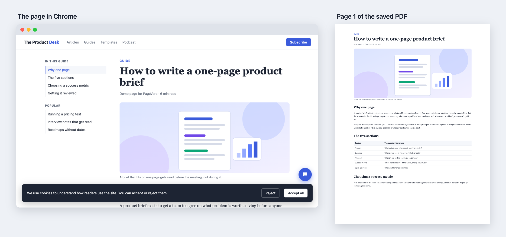
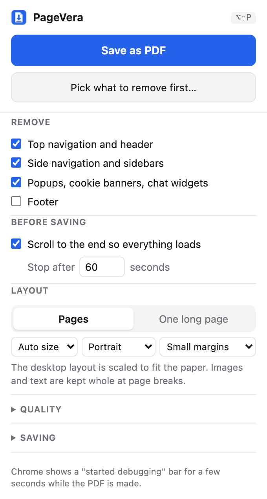

# PageVera: save any web page as a clean PDF

PageVera is a Chrome extension that saves any web page as a clean, high-quality PDF in one click. The name joins "page" with "vera", Latin for true, because the PDF stays true to the original page. Navigation bars, sidebars, cookie banners and chat bubbles are left out. The text stays real text you can search and copy, and the images keep their original resolution.

## The problem

Chrome can already save a page as a PDF, but only through the print dialog, and it prints the page exactly as it is at that moment. On many sites that means:

- Headers, sidebars, cookie banners and chat bubbles print on top of the content or repeat on every page.
- Images that only load as you scroll come out blank or blurry.
- Images and slides get cut in half at page breaks, and some PDFs start with a blank page.
- Lessons and documents shown inside embedded players are cut off at the edge of the player's window.

## Who it's for

People who keep web content to read later, annotate or archive: students saving course lessons, analysts and researchers saving articles and documentation, and anyone who reads offline. I built it for my own use while taking an online course, to keep a PDF of each lesson next to its video.

## What it does

- Saves with one click from the toolbar, a keyboard shortcut or the right-click menu, with no print dialog.
- Removes the top navigation, sidebars, footer, popups, cookie banners and chat widgets, then lets the content use the freed space.
- Lets you click any element on the page to leave it out, with a preview of what the automatic removal will take.
- Scrolls to the end first, so images that load on scroll and infinite feeds are included.
- Keeps text selectable and searchable, keeps links clickable, and embeds images at their original resolution.
- Uses normal paper pages (Letter or A4 depending on your region) and keeps images and slides whole at page breaks. One long page is also available.
- Works inside embedded course players and document viewers, including ones loaded from other sites.
- Names the file after the page, or after the lesson inside a course player. If Chrome asks where to save, its dialog opens in the last folder you used.

## Product decisions

### Chrome's own PDF engine instead of screenshots

Tools that build the PDF from a screenshot turn the page into a picture, so the text can't be searched or copied and images lose sharpness. This extension drives the same engine Chrome uses for printing, which keeps real text and the original image files. The cost is a "started debugging" bar that Chrome shows for a few seconds during each save. The popup says so up front instead of letting it surprise people.

### Automatic removal with a manual override

Rules for spotting navigation and popups handle most sites, but no rule set is right everywhere. The click-to-remove picker lets people fix the rest in a few clicks instead of giving up on the page.

### Paper pages by default

The first version produced one tall page that matched the screen. Testing showed those PDFs were hard to read and print, so the default changed to normal paper pages. Saved settings from the old default are migrated automatically.

### As few permissions as possible

The extension doesn't ask for access to any websites up front. It only works on a tab when you save it, and it never sends page content anywhere. That matters for a tool that reads every page you save.

### Errors that say what to do next

Pages Chrome doesn't let extensions touch, such as its settings pages, get a plain explanation. A tab that is already a PDF gets a "Download original" button instead of an error.

## What changed after testing

I tested each version on the real pages I needed it for and turned what broke into the next round of work. Every fix came with automated tests so the problem can't quietly come back.

| Round | What I saw | Cause | What changed |
|---|---|---|---|
| 1 | A course lesson didn't scroll, was cut off, and the course outline stayed in the PDF | The lesson runs inside frames nested two levels deep in a full-screen player | Prepare every frame on the page, grow each one to its full height, and print the player on its own |
| 2 | A blank first page, an image cut across two pages, and pages far too long to read | The page behind the player printed first, and the default was one long page | Paper pages by default, images and slides kept whole at page breaks, lesson starts on page 1 |
| 3 | A PDF that was one big blank page | Hiding an empty outline column collapsed the lesson to zero width | Fixed the layout step and added a check that no page is empty |
| 4 | Error entries on Chrome's extensions page | A normal refusal was logged as an error, and the popup lost its connection when Chrome paused the extension after 30 idle seconds | Expected refusals are no longer logged, and the popup reconnects on its own |
| 5 | Every lesson got the same file name, and the save dialog always opened in the default folder | The page title names the module rather than the lesson, and Chrome sends extension-named downloads to the default folder | Files are named after the lesson heading, and saves go through Chrome's normal download path so it remembers the folder |

## How quality is checked

The original requirements became automated tests: 48 in total, 29 of which load the extension in a real Chrome and inspect the PDFs it produces. They cover these requirements:

- Text is real text. Fonts are embedded and the page text can be extracted from the PDF.
- Images keep their quality. Each embedded image has its source's full resolution, and JPEG files are embedded byte for byte.
- Removal works. Navigation, cookie banner and chat text is missing from the PDF while the article text is there.
- The whole page loads. The last batch of an infinite feed makes it into the PDF.
- Page breaks are clean, with no blank pages and no slide split across two pages.

## Limitations

- Apps that draw on a canvas, such as Google Docs, Sheets and Figma, come out as images rather than text.
- Feeds that unload items as you scroll past them, such as X, Slack and Gmail, only include what's on screen.
- Chrome shows its "started debugging" bar for a few seconds during each save.

The full list is in [How it works](docs/how-it-works.md#limitations).

## Ideas for what's next

- Publish it on the Chrome Web Store so it installs in one click.
- Save a whole course, or a set of open tabs, in one go.
- Remember what you removed on a site and apply it next time.

## My role

I defined the problem and the requirements, chose between the options at each decision point, tested every version on real pages, and decided what to fix next. The code was written with Claude Code, an AI coding assistant, working from those requirements and my test feedback. It was built over two days in October 2026.

## Try it

Requires Chrome 125 or newer.

1. Download this repository (**Code** > **Download ZIP**, then unzip it) or clone it.
2. Open `chrome://extensions`.
3. Turn on **Developer mode** (top right).
4. Click **Load unpacked** and choose the downloaded folder (`pagevera-main` if you used Download ZIP).
5. Optional: pin the extension from the puzzle-piece menu so the button is always visible.

To save local `file://` pages, open the extension's **Details** and turn on **Allow access to file URLs**.

Then click the toolbar button and choose **Save as PDF**.

- Press **Alt+Shift+P** (⌥⇧P on a Mac) to save without opening the popup. Change it at `chrome://extensions/shortcuts`.
- Right-click a page and choose **Save page as PDF**.
- **Pick what to remove first…** puts a toolbar on the page. Hover to highlight an element, click to remove it, ↑/↓ to select the parent or child, Backspace or ⌘Z to undo, Enter to save, Esc to cancel. **Show automatic removals** outlines what the Remove toggles would take out; click an outline to keep that element. After saving, the removed elements stay hidden until you click **Restore page** or reload, so you can adjust and save again.

While a PDF is being made, Chrome shows a "PageVera started debugging this browser" bar for a few seconds. It disappears when the save finishes. Clicking its Cancel button stops the save. To hide the bar permanently, start Chrome with `--silent-debugger-extension-api`.

## Settings

All settings are in the popup and are remembered.

| Option | Default | What it does |
|---|---|---|
| Top navigation and header | on | Removes site headers, nav bars and announcement bars at the top, including sticky and fixed ones |
| Side navigation and sidebars | on | Removes left and right columns such as doc sidebars and "On this page" lists, then lets the content use the freed space |
| Popups, cookie banners, chat widgets | on | Removes consent banners, modals, chat launchers and bottom bars, and undoes scroll locks |
| Footer | off | Removes the site footer |
| Scroll to the end | on, 60 s | Scrolls through the page so lazy images and infinite feeds load, then returns to the top |
| Layout | Pages, Auto size, small margins | Normal pages with the desktop layout scaled to fit the paper width. Auto size picks Letter in the US and similar regions and A4 elsewhere. Images, slides and lines of text are kept whole at page breaks, including inside embedded course players. **One long page** gives one tall page at your screen width instead; pages taller than 200 inches (the PDF viewer limit) are split into equal parts. |
| Load the highest-resolution images | on, 2× | Switches responsive images (`srcset`, `<picture>`, `image-set()`) to their largest version |
| Keep the on-screen look | on | Ignores the site's print stylesheet |
| Stop animations | on | Finishes fade-in and slide-in animations so nothing prints half-transparent |
| Bookmarks and accessibility tags | on | Adds PDF bookmarks from headings and a tagged structure. Turned off automatically for very large pages. |
| Ask where to save | off | Shows the Save dialog even when Chrome's own "Ask where to save each file" setting is off. Chrome opens this dialog in the default download folder, not the last one used, so turn on Chrome's setting instead if you want that. |
| Downloads subfolder | none | Saves into a folder inside the default download folder |

## More

- [How it works](docs/how-it-works.md): the save pipeline, Chrome's PDF engine, and how to run the tests.
- License: [MIT](LICENSE).
